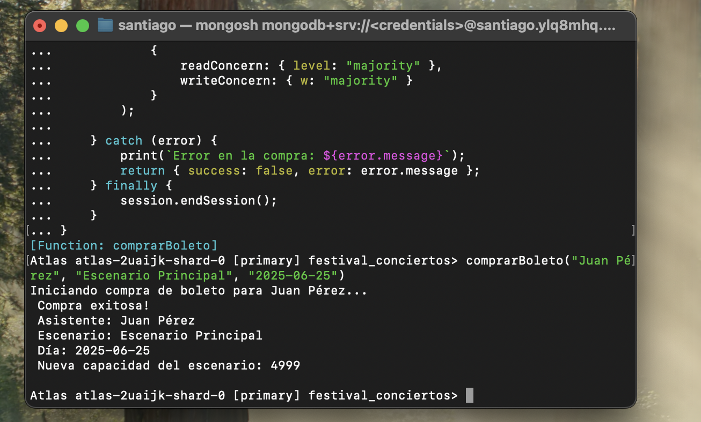

# Proyecto Mongo II - Festival

## Participantes

* Johan Guarin
* Santiago Diaz
* David Medina

# Consultas


## 1 Expresiones Regulares
Buscar bandas cuyo nombre empiece por la letra “A”.


Buscar asistentes cuyo nombre contenga "Gómez".


## 2 Operadores de Arreglos
Buscar asistentes que tengan "Rock" dentro de su campo generos_favoritos.


## 3 Aggregation Framework
Agrupar presentaciones por escenario y contar cuántas presentaciones hay por cada uno.


Calcular el promedio de duración de las presentaciones.


# Funciones en system.js

## 1. Crear una función llamada `escenariosPorCiudad(ciudad)` que devuelva todos los escenarios en esa ciudad.


## 2. Crear una función llamada bandasPorGenero(genero) que devuelva todas las bandas activas de ese género.


## Transacciones (Requiere Replica set)

===== TRANSACCIONES =====

Nota: Estas transacciones requieren que MongoDB esté configurado como replica set

```js
// 1. TRANSACCIÓN: Simular compra de un boleto
function comprarBoleto(nombreAsistente, nombreEscenario, dia) {
    const session = db.getMongo().startSession();
    
    try {
        print(`Iniciando compra de boleto para ${nombreAsistente}...`);
        
        session.withTransaction(
            function() {
                const asistentesCol = session.getDatabase('festival_conciertos').asistentes;
                const escenariosCol = session.getDatabase('festival_conciertos').escenarios;
                
                // 1. Verificar que el asistente existe
                const asistente = asistentesCol.findOne({ nombre: nombreAsistente });
                if (!asistente) {
                    throw new Error(`Asistente '${nombreAsistente}' no encontrado`);
                }
                
                // 2. Verificar que el escenario existe y tiene capacidad
                const escenario = escenariosCol.findOne({ nombre: nombreEscenario });
                if (!escenario) {
                    throw new Error(`Escenario '${nombreEscenario}' no encontrado`);
                }
                
                if (escenario.capacidad <= 0) {
                    throw new Error(`Escenario '${nombreEscenario}' sin capacidad disponible`);
                }
                
                // 3. Verificar que no tenga ya un boleto para ese día y escenario
                const boleteExistente = asistente.boletos_comprados.find(
                    boleto => boleto.escenario === nombreEscenario && boleto.dia === dia
                );
                
                if (boleteExistente) {
                    throw new Error(`${nombreAsistente} ya tiene un boleto para ${nombreEscenario} el ${dia}`);
                }
                
                // 4. Agregar boleto al asistente
                const resultadoAsistente = asistentesCol.updateOne(
                    { nombre: nombreAsistente },
                    { 
                        $push: { 
                            boletos_comprados: { 
                                escenario: nombreEscenario, 
                                dia: dia,
                                fecha_compra: new Date()
                            } 
                        } 
                    }
                );
                
                // 5. Disminuir capacidad del escenario
                const resultadoEscenario = escenariosCol.updateOne(
                    { nombre: nombreEscenario },
                    { $inc: { capacidad: -1 } }
                );
                
                // Verificar que ambas operaciones fueron exitosas
                if (resultadoAsistente.modifiedCount === 0) {
                    throw new Error('Error al agregar boleto al asistente');
                }
                
                if (resultadoEscenario.modifiedCount === 0) {
                    throw new Error('Error al actualizar capacidad del escenario');
                }
                
                print(` Compra exitosa!`);
                print(` Asistente: ${nombreAsistente}`);
                print(` Escenario: ${nombreEscenario}`);
                print(` Día: ${dia}`);
                print(` Nueva capacidad del escenario: ${escenario.capacidad - 1}`);
                
                return { success: true, message: "Compra realizada exitosamente" };
            },
            {
                readConcern: { level: "majority" },
                writeConcern: { w: "majority" }
            }
        );
        
    } catch (error) {
        print(`Error en la compra: ${error.message}`);
        return { success: false, error: error.message };
    } finally {
        session.endSession();
    }
}
```




## 2. Reversar la compra:
    - Eliminar el boleto insertado anteriormente.
    - Incrementar la capacidad del escenario.

```js
// 2. TRANSACCIÓN: Reversar la compra de un boleto
function reversarCompra(nombreAsistente, nombreEscenario, dia) {
    const session = db.getMongo().startSession();
    
    try {
        print(`Iniciando reversión de compra para ${nombreAsistente}...`);
        
        session.withTransaction(
            function() {
                const asistentesCol = session.getDatabase('festival_conciertos').asistentes;
                const escenariosCol = session.getDatabase('festival_conciertos').escenarios;
                
                // 1. Verificar que el asistente existe
                const asistente = asistentesCol.findOne({ nombre: nombreAsistente });
                if (!asistente) {
                    throw new Error(`Asistente '${nombreAsistente}' no encontrado`);
                }
                
                // 2. Verificar que el escenario existe
                const escenario = escenariosCol.findOne({ nombre: nombreEscenario });
                if (!escenario) {
                    throw new Error(`Escenario '${nombreEscenario}' no encontrado`);
                }
                
                // 3. Verificar que el boleto existe
                const boleteExistente = asistente.boletos_comprados.find(
                    boleto => boleto.escenario === nombreEscenario && boleto.dia === dia
                );
                
                if (!boleteExistente) {
                    throw new Error(`No se encontró boleto para ${nombreEscenario} el ${dia}`);
                }
                
                // 4. Eliminar boleto del asistente
                const resultadoAsistente = asistentesCol.updateOne(
                    { nombre: nombreAsistente },
                    { 
                        $pull: { 
                            boletos_comprados: { 
                                escenario: nombreEscenario, 
                                dia: dia 
                            } 
                        } 
                    }
                );
                
                // 5. Incrementar capacidad del escenario
                const resultadoEscenario = escenariosCol.updateOne(
                    { nombre: nombreEscenario },
                    { $inc: { capacidad: 1 } }
                );
                
                // Verificar que ambas operaciones fueron exitosas
                if (resultadoAsistente.modifiedCount === 0) {
                    throw new Error('Error al eliminar boleto del asistente');
                }
                
                if (resultadoEscenario.modifiedCount === 0) {
                    throw new Error('Error al actualizar capacidad del escenario');
                }
                
                print(`Reversión exitosa!`);
                print(` Asistente: ${nombreAsistente}`);
                print(` Escenario: ${nombreEscenario}`);
                print(` Día: ${dia}`);
                print(` Nueva capacidad del escenario: ${escenario.capacidad + 1}`);
                
                return { success: true, message: "Reversión realizada exitosamente" };
            },
            {
                readConcern: { level: "majority" },
                writeConcern: { w: "majority" }
            }
        );
        
    } catch (error) {
        print(`Error en la reversión: ${error.message}`);
        return { success: false, error: error.message };
    } finally {
        session.endSession();
    }
}
```


