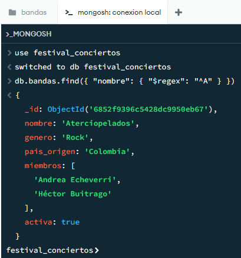
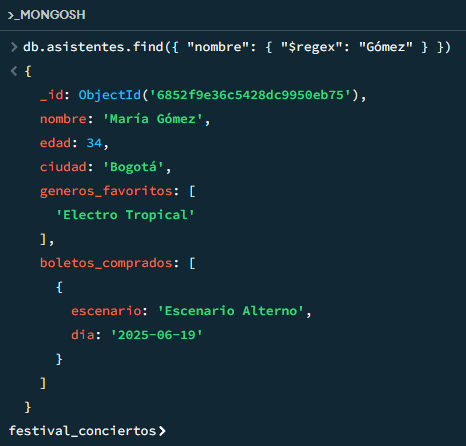
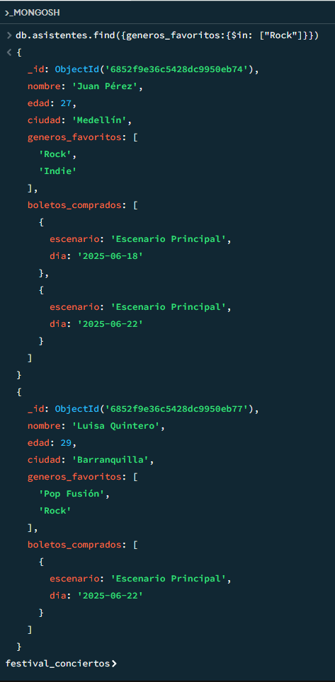
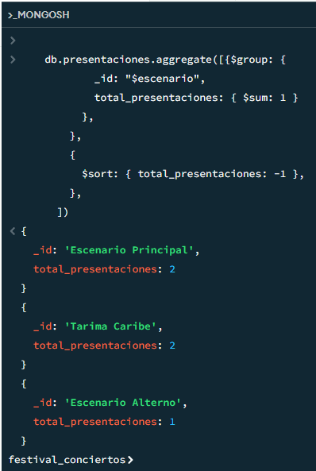
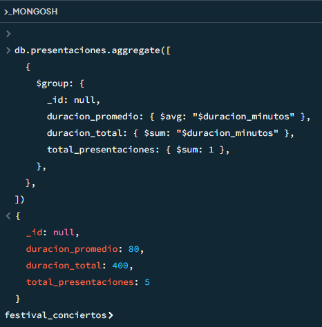
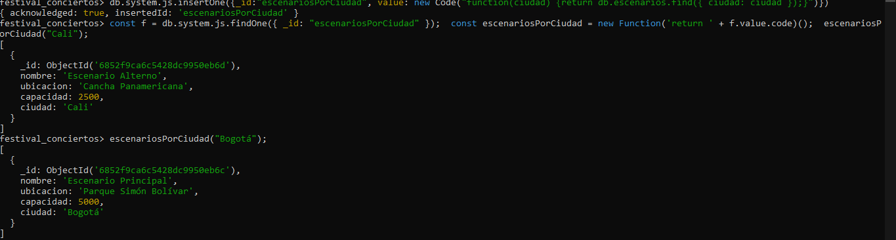
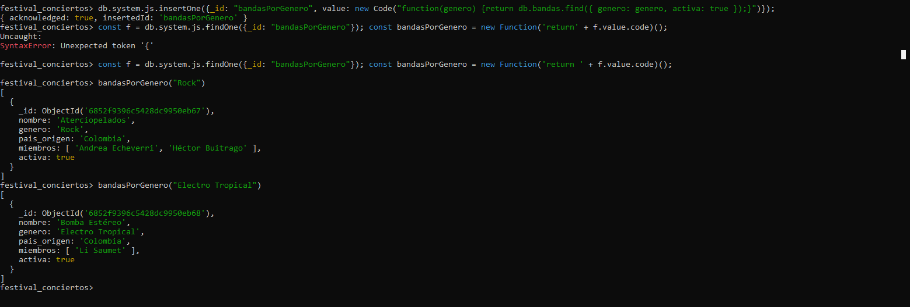

# Proyecto Mongo II - Festival

## Participantes

* Johan Guarin
* Santiago Diaz
* David Medina

# Consultas


## 1 Expresiones Regulares
Buscar bandas cuyo nombre empiece por la letra “A”.



Buscar asistentes cuyo nombre contenga "Gómez".



## 2 Operadores de Arreglos
Buscar asistentes que tengan "Rock" dentro de su campo generos_favoritos.



## 3 Aggregation Framework
Agrupar presentaciones por escenario y contar cuántas presentaciones hay por cada uno.



Calcular el promedio de duración de las presentaciones.



# Funciones en system.js

## 1. Crear una función llamada `escenariosPorCiudad(ciudad)` que devuelva todos los escenarios en esa ciudad.




## 2. Crear una función llamada bandasPorGenero(genero) que devuelva todas las bandas activas de ese género.



## Transacciones (Requiere Replica set)

===== TRANSACCIONES =====

Nota: Estas transacciones requieren que MongoDB esté configurado como replica set

```js
// 1. TRANSACCIÓN: Simular compra de un boleto
function comprarBoleto(nombreAsistente, escenarioNombre, dia) {
  const session = db.getMongo().startSession();
  
  try {
    session.startTransaction();
    
    // Verificar que el escenario existe y tiene capacidad disponible
    const escenario = db.escenarios.findOne(
      { nombre: escenarioNombre },
      { session: session }
    );
    
    if (!escenario) {
      throw new Error("Escenario no encontrado");
    }
    
    if (escenario.capacidad <= 0) {
      throw new Error("No hay capacidad disponible en el escenario");
    }
    
    // Verificar que el asistente existe
    const asistente = db.asistentes.findOne(
      { nombre: nombreAsistente },
      { session: session }
    );
    
    if (!asistente) {
      throw new Error("Asistente no encontrado");
    }
    
    // Crear el nuevo boleto
    const nuevoBoleto = {
      escenario: escenarioNombre,
      dia: dia
    };
    
    // Insertar boleto en el array de boletos_comprados del asistente
    const resultadoAsistente = db.asistentes.updateOne(
      { nombre: nombreAsistente },
      { $push: { boletos_comprados: nuevoBoleto } },
      { session: session }
    );
    
    if (resultadoAsistente.modifiedCount === 0) {
      throw new Error("No se pudo agregar el boleto al asistente");
    }
    
    // Disminuir la capacidad del escenario en 1
    const resultadoEscenario = db.escenarios.updateOne(
      { nombre: escenarioNombre },
      { $inc: { capacidad: -1 } },
      { session: session }
    );
    
    if (resultadoEscenario.modifiedCount === 0) {
      throw new Error("No se pudo actualizar la capacidad del escenario");
    }
    
    // Confirmar la transacción
    session.commitTransaction();
    
    console.log(`Boleto comprado exitosamente para ${nombreAsistente}`);
    console.log(`   Escenario: ${escenarioNombre}`);
    console.log(`   Día: ${dia}`);
    console.log(`   Nueva capacidad del escenario: ${escenario.capacidad - 1}`);
    
    return { success: true, message: "Boleto comprado exitosamente" };
    
  } catch (error) {
    // Reversar la transacción en caso de error
    session.abortTransaction();
    console.log(` Error en la compra: ${error.message}`);
    return { success: false, message: error.message };
    
  } finally {
    session.endSession();
  }
}
```

## 2. Reversar la compra:
    - Eliminar el boleto insertado anteriormente.
    - Incrementar la capacidad del escenario.

```js
// 2. TRANSACCIÓN: Reversar la compra de un boleto
function reversarCompraBoleto(nombreAsistente, escenarioNombre, dia) {
  const session = db.getMongo().startSession();
  
  try {
    session.startTransaction();
    
    // Verificar que el asistente existe y tiene el boleto
    const asistente = db.asistentes.findOne(
      { 
        nombre: nombreAsistente,
        boletos_comprados: { 
          $elemMatch: { 
            escenario: escenarioNombre, 
            dia: dia 
          } 
        }
      },
      { session: session }
    );
    
    if (!asistente) {
      throw new Error("Asistente no encontrado o no tiene este boleto");
    }
    
    // Eliminar el boleto del array de boletos_comprados del asistente
    const resultadoAsistente = db.asistentes.updateOne(
      { nombre: nombreAsistente },
      { 
        $pull: { 
          boletos_comprados: { 
            escenario: escenarioNombre, 
            dia: dia 
          } 
        } 
      },
      { session: session }
    );
    
    if (resultadoAsistente.modifiedCount === 0) {
      throw new Error("No se pudo eliminar el boleto del asistente");
    }
    
    // Incrementar la capacidad del escenario en 1
    const resultadoEscenario = db.escenarios.updateOne(
      { nombre: escenarioNombre },
      { $inc: { capacidad: 1 } },
      { session: session }
    );
    
    if (resultadoEscenario.modifiedCount === 0) {
      throw new Error("No se pudo actualizar la capacidad del escenario");
    }
    
    // Confirmar la transacción
    session.commitTransaction();
    
    console.log(`✅ Compra reversada exitosamente para ${nombreAsistente}`);
    console.log(`   Escenario: ${escenarioNombre}`);
    console.log(`   Día: ${dia}`);
    
    return { success: true, message: "Compra reversada exitosamente" };
    
  } catch (error) {
    // Reversar la transacción en caso de error
    session.abortTransaction();
    console.log(`❌ Error al reversar la compra: ${error.message}`);
    return { success: false, message: error.message };
    
  } finally {
    session.endSession();
  }
}

```


